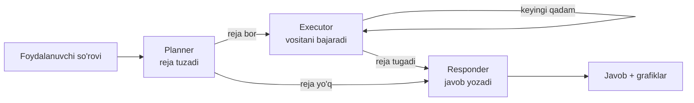

# 🤖 AI Data Analysis Agent

Ma'lumotlarni avtomatik tahlil qilish, vizualizatsiya qilish va mashinaviy o'qitish (ML) modellarini o'qitish uchun mo'ljallangan Python loyihasi. Loyiha lokal **Ollama** LLM modeli va **LangGraph** asosidagi agent arxitekturasiga tayanadi: foydalanuvchi savol beradi, agent esa ma'lumotlar ustida kerakli tahlilni bajaradi.

> **Loyiha holati: ishga tayyor.** Tahlil, vizualizatsiya, ML, LangGraph agenti, FastAPI server, Streamlit dashboard, PDF hisobot va testlar mavjud. **Ollama o'rnatilmagan bo'lsa ham agent ishlaydi** (qoidali rejalashtiruvchiga o'tadi).

---

## 📑 Mundarija

1. [Imkoniyatlar](#-imkoniyatlar)
2. [Loyiha holati va rejalar](#-loyiha-holati-va-rejalar)
3. [Texnologiyalar](#-texnologiyalar)
4. [Papka tuzilishi](#-papka-tuzilishi)
5. [O'rnatish](#-ornatish)
6. [Sozlamalar (.env)](#-sozlamalar-env)
7. [Ishga tushirish](#-ishga-tushirish)
8. [Foydalanish namunalari](#-foydalanish-namunalari)
9. [Modullar tavsifi](#-modullar-tavsifi)
10. [Ma'lumotlar bazasi](#-malumotlar-bazasi)
11. [Xavfsizlik](#-xavfsizlik)
12. [Litsenziya](#-litsenziya)

---

## ✨ Imkoniyatlar

### 📊 Avtomatik tahlil (EDA)
- Jadval o'lchami, ustunlar va ma'lumot turlari
- Yo'qolgan qiymatlar (soni va foizi)
- Takrorlanuvchi qatorlar
- Raqamli ustunlar bo'yicha tavsifiy statistika (o'rtacha, std, kvartillar va h.k.)
- Kategorik ustunlar: noyob qiymatlar soni va eng ko'p uchraydigan 10 ta qiymat
- Korrelyatsiya matritsasi

### 🚨 Anomaliyalarni aniqlash
- **IQR** usuli (pastki/yuqori chegara, anomaliyalar soni va foizi)
- **Z-score** usuli (chegara qiymati sozlanadi, standart: 3.0)
- Barcha raqamli ustunlar bo'yicha bir yo'la tekshirish

### 📈 Vizualizatsiya
Matplotlib va Seaborn asosida 12 turdagi grafik: gistogramma, ustunli diagramma, scatter, chiziqli grafik, box plot, doira (pie) diagramma, issiqlik xaritasi (heatmap), violin plot, count plot, taqsimot (KDE) grafigi, pair plot. Grafiklar PNG formatida saqlanadi.

### 🧠 Mashinaviy o'qitish
- **Regressiya**, **klassifikatsiya** va **klasterlash** masalalari
- Masala turini avtomatik aniqlash (maqsadli ustun turiga qarab)
- Avtomatik oldindan ishlov berish: bo'sh qiymatlarni to'ldirish, masshtablash (standard / minmax / robust), kategorik ustunlarni One-Hot kodlash
- Train/test bo'lish, K-Fold kross-validatsiya
- GridSearchCV orqali giperparametrlarni tanlash (random forest, decision tree, KNN uchun)
- Baholash metrikalari: MAE, MSE, RMSE, R², MAPE; accuracy, precision, recall, F1, ROC-AUC, confusion matrix; silhouette score
- Modelni `.pkl` fayl sifatida saqlash

### 🔍 Model izohi
- Modelning o'z feature importance qiymatlari (daraxtli modellar va chiziqli modellar uchun)
- Permutation importance

### 🤖 AI agent (LangGraph)
- Tabiiy tilda (o'zbekcha) so'rov: *"umumiy tahlil qil, so'ng sotib_oldi ni bashorat qiladigan model o'qit"*
- Agent so'rovni vositalar ketma-ketligiga (reja) aylantiradi, bajaradi va natijani tushuntiradi
- Suhbat xotirasi (SQLite): agent oldingi xabarlarni eslab qoladi
- **Ollama bo'lmasa ham ishlaydi**: LLM ulanmasa, kalit so'zlarga asoslangan rejalashtiruvchi va tayyor xulosa shabloni ishlatiladi

### 🌐 REST API (FastAPI)
Sessiyalar, dataset yuklash, EDA, agent bilan suhbat, grafiklar, modellar va PDF hisobot. Avtomatik hujjat: `http://localhost:8000/docs`.

### 🖥 Dashboard (Streamlit)
Dataset yuklash, EDA, grafik tuzuvchi, model o'qitish va klasterlash, agent bilan suhbat, PDF hisobotni yuklab olish.

### 📄 PDF hisobot
Umumiy ma'lumot, ustunlar, statistika, anomaliyalar, grafiklar va o'qitilgan modellar bitta PDF faylda.

### 🗄 Ma'lumotlar bazasi
SQLite orqali sessiyalar, suhbat tarixi, yuklangan datasetlar, modellar va grafiklarni saqlash.

---

## ✅ Loyiha holati va rejalar

| Qism | Holat |
|------|-------|
| Konfiguratsiya (`app/core`) | ✅ Tayyor |
| Statistik tahlil va anomaliyalar (`app/analysis`) | ✅ Tayyor |
| Vizualizatsiya (`app/visualization`) | ✅ Tayyor |
| ML: o'qitish, baholash, izohlash (`app/ml`) | ✅ Tayyor |
| SQLite baza va repozitoriylar (`app/database`) | ✅ Tayyor |
| Fayl saqlash va dataset xizmati (`app/services`) | ✅ Tayyor |
| Agent vositalari va PDF hisobot (`app/tools`) | ✅ Tayyor |
| Suhbat xotirasi (`app/memory`) | ✅ Tayyor |
| LangGraph agenti (`app/agents`) | ✅ Tayyor |
| FastAPI server (`app/api`) | ✅ Tayyor |
| Streamlit dashboard (`app/ui`) | ✅ Tayyor |
| Testlar (`tests/`) | ✅ 23 ta test |

**Ma'lum cheklovlar va keyingi rejalar:**

- **Autentifikatsiya yo'q.** `SECRET_KEY` va `ACCESS_TOKEN_EXPIRE_MINUTES` sozlamalari mavjud, lekin token tizimi hali yozilmagan. API'ni internetga ochmang, faqat lokal yoki ishonchli tarmoqda ishlating.
- `shap_summary` hozircha haqiqiy SHAP emas, permutation importance natijasi.
- LLM sifati tanlangan Ollama modeliga bog'liq. Kichik modellar reja tuzishda xato qilishi mumkin, bunda qoidali rejalashtiruvchi ishga tushadi.
- Rejalar: JWT autentifikatsiya, haqiqiy SHAP, Docker, ko'proq tilda so'rovlarni tushunish.

---

## 🛠 Texnologiyalar

| Yo'nalish | Kutubxonalar |
|-----------|--------------|
| Ma'lumotlar | pandas, numpy, openpyxl |
| Vizualizatsiya | matplotlib, seaborn |
| ML | scikit-learn, XGBoost, LightGBM, CatBoost |
| Model izohi | SHAP, LIME (o'rnatiladi; hozirgi kodda permutation importance ishlatiladi) |
| Agent / LLM | LangGraph, LangChain (core, community, ollama), **Ollama** |
| Backend | FastAPI, Uvicorn, python-multipart, httpx |
| Frontend | Streamlit |
| Sozlamalar | pydantic, pydantic-settings, python-dotenv |
| Hisobot | fpdf2 |
| Baza | SQLite (Python standart kutubxonasi) |
| Test | pytest, pytest-anyio |

---

## 📂 Papka tuzilishi

```
AI_Data_Analysis_Agent/
├── main.py                  # Kirish nuqtasi (api | ui | setup)
├── conftest.py              # pytest uchun sys.path sozlamasi
├── requirements.txt         # Kutubxonalar ro'yxati
├── .env.example             # Sozlamalar namunasi
├── LICENSE                  # MIT litsenziya
│
├── app/
│   ├── core/
│   │   ├── config.py        # Sozlamalar (pydantic-settings, .env dan o'qiydi)
│   │   └── llm.py           # Ollama LLM: get_llm() (JSON), get_chat_llm() (erkin matn)
│   ├── agents/
│   │   ├── __init__.py      # run_agent(): agentning kirish nuqtasi
│   │   ├── graph.py         # LangGraph oqimi: planner -> executor -> responder
│   │   ├── nodes.py         # Graf tugunlari
│   │   ├── planner.py       # LLM va qoidali rejalashtiruvchi
│   │   └── summary.py       # Natijalardan o'zbekcha xulosa
│   ├── tools/
│   │   ├── loader.py        # CSV/Excel/JSON yuklash
│   │   ├── registry.py      # 8 ta agent vositasi (eda, outliers, chart, train_model ...)
│   │   └── report.py        # PDF hisobot (fpdf2)
│   ├── memory/
│   │   └── conversation.py  # ConversationMemory: SQLite tarixi -> LangChain xabarlari
│   ├── analysis/
│   │   ├── statistics.py    # StatsAnalyzer: EDA
│   │   └── outliers.py      # OutlierDetector: IQR va Z-score
│   ├── visualization/
│   │   └── engine.py        # VisualizationEngine: grafiklar
│   ├── ml/
│   │   ├── train.py         # MLTrainer: o'qitish
│   │   ├── evaluate.py      # MLEvaluator: baholash
│   │   └── explain.py       # MLExplainer: feature importance
│   ├── api/
│   │   └── server.py        # FastAPI ilovasi
│   ├── ui/
│   │   └── dashboard.py     # Streamlit dashboard
│   ├── database/
│   │   ├── connection.py    # SQLite ulanishi, jadvallarni yaratish
│   │   └── repository.py    # Session/Conversation/Dataset/Model/Chart repozitoriylari
│   ├── schemas/
│   │   ├── api.py           # API so'rov/javob modellari
│   │   └── state.py         # AgentState (LangGraph holati)
│   ├── services/
│   │   ├── storage.py       # StorageService: fayl va papkalar bilan ishlash
│   │   └── datasets.py      # DatasetService: yuklash, tekshirish, o'qish
│   └── utils/
│       └── logging.py       # Rangli logger
│
├── tests/                   # 23 ta pytest testi
├── assets/sample_data.csv   # Namunaviy dataset (400 ta sintetik mijoz)
├── scripts/generate_sample_data.py   # Namunaviy datasetni qayta yaratish
├── docs/architecture.md     # Arxitektura tavsifi
│
└── storage/                 # Ish vaqtida yaratiladi (git'ga yuklanmaydi)
    ├── uploads/             # Yuklangan datasetlar
    ├── charts/              # Grafiklar
    ├── reports/             # PDF hisobotlar
    ├── models/              # Saqlangan modellar (.pkl)
    └── db.sqlite            # SQLite baza
```

---

## 📥 O'rnatish

### Talablar
- **Python 3.10 yoki yuqori**
- **Git**
- **Ollama** (LLM qismi ishlatilganda): [ollama.com](https://ollama.com)

### 1. Loyihani yuklab olish

```bash
git clone https://github.com/nuriddindomonov68/Uzbekiston-qonunchiligi-RAG.git
cd Uzbekiston-qonunchiligi-RAG
```

### 2. Virtual muhit yaratish

**Windows (PowerShell / CMD):**
```bash
python -m venv venv
venv\Scripts\activate
```

**Linux / macOS:**
```bash
python3 -m venv venv
source venv/bin/activate
```

### 3. Kutubxonalarni o'rnatish

```bash
pip install -r requirements.txt
```

> CatBoost, LightGBM va XGBoost og'ir kutubxonalar, o'rnatish bir necha daqiqa olishi mumkin. Agar biri o'rnatilmasa ham, kod ishlayveradi: bu kutubxonalar ixtiyoriy import qilingan, mavjud bo'lmasa shunchaki algoritmlar ro'yxatidan chiqib ketadi.

### 4. Sozlamalar faylini yaratish

```bash
# Windows
copy .env.example .env

# Linux / macOS
cp .env.example .env
```

So'ng `.env` faylini ochib, `SECRET_KEY` ga o'zingizning tasodifiy kalitingizni yozing:

```bash
python -c "import secrets; print(secrets.token_urlsafe(32))"
```

### 5. Ollama modelini yuklab olish (ixtiyoriy)

```bash
ollama pull llama3.2
```

Ollama dasturi ishlab turganiga ishonch hosil qiling (standart manzil: `http://localhost:11434`). **Bu qadam majburiy emas:** Ollama bo'lmasa agent qoidali rejimda ishlaydi. Faqat LLM'ni butunlay o'chirib qo'ymoqchi bo'lsangiz, `.env` da `LLM_ENABLED=False` yozing.

### 6. Bazani va papkalarni tayyorlash

```bash
python main.py setup
```

Muvaffaqiyatli bo'lsa: `✅ Database and storage directories initialised successfully.`

---

## ⚙️ Sozlamalar (.env)

Barcha sozlamalar `app/core/config.py` orqali `.env` faylidan o'qiladi. Fayl bo'lmasa, quyidagi standart qiymatlar ishlatiladi.

| O'zgaruvchi | Standart qiymat | Tavsif |
|-------------|-----------------|--------|
| `APP_NAME` | `AI Data Analysis Agent` | Ilova nomi |
| `DEBUG` | `True` | Debug rejimi (serverni avtomatik qayta yuklaydi) |
| `HOST` | `0.0.0.0` | Server manzili |
| `PORT` | `8000` | Server porti |
| `OLLAMA_BASE_URL` | `http://localhost:11434` | Ollama manzili |
| `LLM_MODEL` | `llama3.2:latest` | Ishlatiladigan LLM modeli |
| `LLM_ENABLED` | `True` | `False` bo'lsa LLM ishlatilmaydi (faqat qoidali rejim) |
| `MAX_UPLOAD_MB` | `50` | Yuklanadigan fayl hajmi chegarasi (MB) |
| `CORS_ORIGINS` | `http://localhost:8501,http://127.0.0.1:8501` | API'ga ruxsat berilgan manbalar (vergul bilan) |
| `STORAGE_DIR` | `./storage` | Asosiy saqlash papkasi |
| `UPLOAD_DIR` | `./storage/uploads` | Yuklangan fayllar |
| `CHARTS_DIR` | `./storage/charts` | Grafiklar |
| `REPORTS_DIR` | `./storage/reports` | Hisobotlar |
| `MODELS_DIR` | `./storage/models` | Saqlangan modellar |
| `SECRET_KEY` | — | Maxfiy kalit. **Albatta o'zgartiring** |
| `ACCESS_TOKEN_EXPIRE_MINUTES` | `1440` | Token amal qilish muddati (daqiqa) |

---

## ▶️ Ishga tushirish

`main.py` uch xil rejimni qo'llab-quvvatlaydi:

```bash
python main.py setup   # Bazani va papkalarni yaratadi
python main.py api     # FastAPI serverini ishga tushiradi (http://localhost:8000)
python main.py ui      # Streamlit dashboardini ishga tushiradi (http://localhost:8501)
```

Parametrsiz `python main.py` ishga tushirilsa, `api` rejimi tanlanadi.

**Eng tez boshlash (dashboard):**

```bash
python main.py ui
```

Brauzerda `http://localhost:8501` ochiladi. Chap paneldagi **"Namunaviy ma'lumotni yuklash"** tugmasini bosing va **Agent** bo'limida yozing: `umumiy tahlil qil` yoki `sotib_oldi ni bashorat qiladigan model o'qit`.

### 🌐 API endpointlari

Interaktiv hujjat: `http://localhost:8000/docs`

| Metod | Yo'l | Vazifasi |
|-------|------|----------|
| GET | `/health` | Server holati |
| POST | `/sessions` | Yangi sessiya yaratish |
| GET | `/sessions` | Sessiyalar ro'yxati |
| GET / DELETE | `/sessions/{id}` | Sessiyani olish / o'chirish |
| GET | `/sessions/{id}/history` | Suhbat tarixi |
| GET | `/sessions/{id}/datasets` | Sessiya datasetlari |
| GET | `/sessions/{id}/models` | O'qitilgan modellar |
| GET | `/sessions/{id}/charts` | Yaratilgan grafiklar |
| POST | `/datasets/upload` | Dataset yuklash (`session_id` + `file`) |
| GET | `/datasets/{id}` | Dataset ma'lumoti |
| GET | `/datasets/{id}/preview?rows=10` | Dastlabki qatorlar |
| GET | `/datasets/{id}/eda` | To'liq EDA natijasi |
| POST | `/datasets/{id}/report` | PDF hisobotni yaratish va yuklab olish |
| POST | `/chat` | Agentga savol berish (`session_id`, `message`) |
| GET | `/charts/{id}` | Grafik rasmini olish (PNG) |

**curl bilan misol:**

```bash
# 1. Sessiya yaratish
curl -X POST http://localhost:8000/sessions
# 2. Dataset yuklash (SESSION_ID o'rniga javobdagi session_id)
curl -F "session_id=SESSION_ID" -F "file=@assets/sample_data.csv" http://localhost:8000/datasets/upload
# 3. Agentga savol
curl -X POST http://localhost:8000/chat -H "Content-Type: application/json" \
     -d '{"session_id": "SESSION_ID", "message": "umumiy tahlil qil"}'
```

### 🤖 Agent qanday ishlaydi



1. **Planner**: LLM (Ollama) so'rovdan JSON ko'rinishida reja tuzadi. LLM ishlamasa yoki noto'g'ri javob bersa, kalit so'zlarga asoslangan qoidali rejalashtiruvchi ishga tushadi.
2. **Executor**: rejadagi vositalarni ketma-ket bajaradi. Biror vosita xato bersa, agent to'xtamaydi, xatoni javobda ko'rsatadi.
3. **Responder**: natijalardan aniq xulosa tuzadi. LLM yoqilgan bo'lsa, uni ravon tushuntirishga aylantiradi, raqamlar esa o'zgarmaydi.

**Mavjud vositalar:** `eda`, `outliers`, `chart`, `auto_charts`, `train_model`, `cluster`, `explain_model`, `report`.

**Namunaviy so'rovlar:**

| So'rov | Natija |
|--------|--------|
| `umumiy tahlil qil` | EDA xulosasi |
| `anomaliyalarni top` | IQR bo'yicha anomaliyalar |
| `korrelyatsiya xaritasini chiz` | Heatmap |
| `yosh va oylik_daromad bo'yicha scatter chiz` | Scatter grafik |
| `sotib_oldi ni bashorat qiladigan model o'qit` | Model + metrikalar |
| `xgboost bilan sotib_oldi ni bashorat qil` | Berilgan algoritm bilan model |
| `qaysi ustunlar muhim?` | Feature importance |
| `3 ta klasterga ajrat` | K-Means klasterlash |
| `PDF hisobot yarat` | PDF fayl |

---

## 🧪 Testlar

```bash
pytest -q
```

23 ta test tahlil, ML, baza, vositalar, agent va API'ni tekshiradi. Testlar vaqtinchalik papkada va LLM'siz ishlaydi, shuning uchun Ollama kerak emas va sizning `storage/` papkangizga tegmaydi.

---

## 💻 Foydalanish namunalari

Quyidagi kodlar loyiha papkasidan ishga tushirilganda ishlaydi.

### 0. Agentni kod ichidan ishlatish

```python
from app.database.connection import init_db
from app.services.datasets import DatasetService
from app.agents import run_agent

init_db()
with open("assets/sample_data.csv", "rb") as f:
    DatasetService.register_upload("mening-sessiyam", "sample_data.csv", f.read())

natija = run_agent("mening-sessiyam", "umumiy tahlil qil va korrelyatsiya xaritasini chiz")
print(natija["response"])      # matnli javob
print(natija["chart_paths"])   # yaratilgan grafik fayllari
```

### 1. Tezkor tahlil (EDA)

```python
import pandas as pd
from app.analysis import StatsAnalyzer

df = pd.read_csv("data.csv")
eda = StatsAnalyzer.run_full_eda(df)

print(eda["basic_info"])         # o'lcham, ustunlar
print(eda["missing_values"])     # yo'qolgan qiymatlar
print(eda["numerical_summary"])  # raqamli statistika
```

`run_full_eda` quyidagi kalitlarni qaytaradi: `basic_info`, `data_types`, `missing_values`, `duplicate_rows`, `numerical_summary`, `categorical_summary`, `correlation_matrix`.

### 2. Anomaliyalarni topish

```python
from app.analysis import OutlierDetector

# Bitta ustun bo'yicha
print(OutlierDetector.detect_iqr(df, "daromad"))
print(OutlierDetector.detect_zscore(df, "daromad", threshold=3.0))

# Barcha raqamli ustunlar bo'yicha
print(OutlierDetector.get_all_outliers(df, method="iqr"))
```

### 3. Grafik chizish

```python
from app.visualization import VisualizationEngine

path = VisualizationEngine.generate_chart(
    df,
    chart_type="histogram",
    x="daromad",
    output_path="storage/charts/daromad.png",
)
print("Saqlandi:", path)
```

Qo'llab-quvvatlanadigan `chart_type` qiymatlari: `histogram`, `bar_chart`, `scatter_plot`, `line_chart`, `box_plot`, `pie_chart`, `heatmap`, `violin_plot`, `count_plot`, `distribution_plot`, `pair_plot`.

### 4. Modelni o'qitish

```python
from app.ml import MLTrainer

natija = MLTrainer.train_supervised(
    df,
    target_col="sotib_oldi",
    algorithm="random_forest",   # masalan: xgboost, lightgbm, svm, knn ...
    scaling="standard",          # standard | minmax | robust
    test_size=0.2,
    cv_folds=5,
    hyperparameter_tuning=False,
    session_id="demo",
)

print(natija["task_type"])   # classification yoki regression (avtomatik)
print(natija["metrics"])     # baholash natijalari
print(natija["filepath"])    # saqlangan .pkl fayl yo'li
```

### 5. Klasterlash

```python
natija = MLTrainer.train_clustering(
    df,
    features=["yosh", "daromad"],
    algorithm="kmeans",   # kmeans | dbscan | hierarchical
    n_clusters=3,
    session_id="demo",
)
print(natija["metrics"])  # {'silhouette_score': ...}
```

### 6. Modelni izohlash

```python
from app.ml import MLExplainer

importance = MLExplainer.get_feature_importance(natija_model_yoli, df)
print(importance["native_importance"])
print(importance["permutation_importance"])
```

> Eslatma: `shap_summary` kaliti hozircha haqiqiy SHAP qiymatlarini emas, permutation importance natijasini qaytaradi.

---

## 🧩 Modullar tavsifi

### `app/core`
- **`config.py`**: `Settings` klassi `.env` faylini o'qiydi va `settings` obyektini beradi. `DB_PATH` xususiyati SQLite fayl yo'lini hisoblaydi.
- **`llm.py`**: Ollama bilan ishlash. `get_llm()` JSON formatida javob beradigan, `temperature=0` bilan aniq LLM qaytaradi (agent mantig'i uchun). `get_chat_llm()` erkin suhbat uchun `temperature=0.7` bilan LLM qaytaradi.

### `app/agents`
- **`run_agent(session_id, message)`**: xabarni agentga beradi, javob, grafiklar va vosita natijalarini qaytaradi.
- **`planner.py`**: `make_plan` (LLM, zaxirada `heuristic_plan`). **`nodes.py`**: `planner_node`, `executor_node`, `responder_node`. **`graph.py`**: LangGraph oqimi. **`summary.py`**: natijalardan xulosa.

### `app/tools`
- **`registry.py`**: 8 ta vosita va `run_tool()` (xatoni istisno sifatida emas, natija sifatida qaytaradi). `train_model` ID va erkin matn ustunlarini avtomatik chiqarib tashlaydi.
- **`loader.py`**: CSV, TSV, Excel, JSON yuklash. **`report.py`**: PDF hisobot.

### `app/memory`
- **`ConversationMemory`**: oxirgi xabarlarni SQLite'dan olib, LangChain xabarlariga aylantiradi.

### `app/api` va `app/ui`
- **`server.py`**: FastAPI endpointlari (yuqoridagi jadval). **`dashboard.py`**: 5 bo'limli Streamlit ilovasi (Agent, EDA, Grafiklar, Modellar, Hisobot).

### `app/analysis`
- **`StatsAnalyzer`**: `get_basic_info`, `get_data_types`, `get_missing_values`, `get_duplicate_rows`, `get_numerical_summary`, `get_categorical_summary`, `get_correlation_matrix`, `run_full_eda`.
- **`OutlierDetector`**: `detect_iqr`, `detect_zscore`, `get_all_outliers`.

### `app/visualization`
- **`VisualizationEngine.generate_chart`**: DataFrame, grafik turi, `x`, `y`, `hue`, sarlavha va saqlash yo'lini qabul qiladi, PNG fayl yaratib, uning to'liq yo'lini qaytaradi.

### `app/ml`
- **`MLTrainer`**: `train_supervised`, `train_clustering`, `detect_task_type`.
- **`MLEvaluator`**: `evaluate_regression`, `evaluate_classification`, `evaluate_clustering`.
- **`MLExplainer`**: `get_feature_importance`.

**Qo'llab-quvvatlanadigan algoritmlar:**

| Masala | Algoritmlar |
|--------|-------------|
| Regressiya | `linear_regression`, `ridge`, `lasso`, `decision_tree`, `random_forest`, `gradient_boosting`, `knn`, `svm`, `xgboost`*, `lightgbm`*, `catboost`* |
| Klassifikatsiya | `logistic_regression`, `naive_bayes`, `knn`, `svm`, `decision_tree`, `random_forest`, `gradient_boosting`, `xgboost`*, `lightgbm`*, `catboost`* |
| Klasterlash | `kmeans`, `dbscan`, `hierarchical` (agglomerative) |

\* Kutubxona o'rnatilgan bo'lsa mavjud bo'ladi. Noma'lum algoritm nomi berilsa, `random_forest` ishlatiladi.

### `app/database`
- **`connection.py`**: `get_db_connection()` (kontekst menejer: avtomatik commit/rollback) va `init_db()` (jadvallarni yaratish).
- **`repository.py`**: `SessionRepository`, `ConversationRepository`, `DatasetRepository`, `ModelRepository`, `ChartRepository`.

### `app/services`
- **`StorageService`**: papkalarni yaratish va yuklangan fayl, grafik, hisobot va model uchun sessiyaga xos yo'llarni berish.
- **`DatasetService`**: yuklangan faylni tekshiradi (tur, hajm, bo'shlik), fayl nomini xavfsiz holatga keltiradi, bazaga yozadi.

### `app/schemas`
- **`api.py`**: `SessionCreate`, `SessionResponse`, `ChatRequest`, `ChatResponse`, `DatasetResponse`, `ModelResponse`.
- **`state.py`**: `AgentState`: LangGraph tugunlari orasida uzatiladigan yagona holat (xabarlar, dataset, reja, joriy qadam, vosita natijalari, xato konteksti, yakuniy javob).

---

## 🗄 Ma'lumotlar bazasi

SQLite fayli `storage/db.sqlite` da yaratiladi. Jadvallar:

| Jadval | Vazifasi |
|--------|----------|
| `sessions` | Foydalanuvchi sessiyalari va ularning sozlamalari |
| `conversations` | Suhbat tarixi (rol, matn, vaqt) |
| `datasets` | Yuklangan datasetlar: fayl nomi, yo'li, turi, qator/ustun soni, sxema |
| `models` | O'qitilgan modellar: algoritm, maqsadli ustun, feature'lar, metrikalar, fayl yo'li |
| `charts` | Yaratilgan grafiklar: sarlavha, turi, fayl yo'li |

Barcha jadvallar `sessions` ga bog'langan; sessiya o'chirilsa, unga tegishli yozuvlar ham o'chadi (`ON DELETE CASCADE`).

---

## 🔒 Xavfsizlik

- **`.env` faylini hech qachon GitHub'ga yuklamang.** U `.gitignore` ga qo'shilgan, lekin brauzer orqali ("Upload files") yuklasangiz, `.gitignore` hisobga olinmaydi. Terminal yoki GitHub Desktop ishlating.
- **`SECRET_KEY` ni o'zgartiring** va uni hech kimga ko'rsatmang.
- **Pickle fayllar haqida:** modellar `pickle` formatida saqlanadi. Ishonchsiz manbadan olingan `.pkl` faylni ochmang, chunki unda zararli kod bo'lishi mumkin.
- Yuklangan datasetlar `storage/uploads/` da saqlanadi va git'ga kirmaydi. Fayl nomlari tozalanadi (yo'l almashtirish hujumlaridan himoya), tur va hajm tekshiriladi.
- **API'da autentifikatsiya yo'q.** Uni internetga ochmang; faqat lokal yoki ishonchli tarmoqda ishlating.

---

## 📄 Litsenziya

Loyiha **MIT** litsenziyasi ostida tarqatiladi. Batafsil ma'lumot uchun [LICENSE](LICENSE) fayliga qarang.
